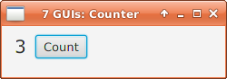

= GUI 1: Counter

Here is how it looks like:

== Usage

You can run the application either from the commandline or from the IDE.

=== Commandline

From the commandline in folder _combined_ invoke:

----
./gradlew run
----

=== IntelliJ IDEA

To run it from IntelliJ IDEA simply open _build.gradle_ in the folder _combined_ and then run _ApplicationInMemoryStarter_.

=== Other IDEs

With the proper gradle support/plugins it should also be possible to open the gradle files with Eclipse or Netbeans.
Alternatively you can convert the gradle files to maven pom files.

== How it is done

From an OpenDolphin point of view the interesting parts are the following:

In the start routine of the JavaFX Application *initializePMs* is called which sends the INIT command to the server side.
It's *onFinishedHandler* calls *setupBinding*:

.Application.java
----
@Override
public void start(Stage stage) throws Exception {
  Pane root = setupStage();
  initializePMs();
  ...
----

.initializePMs()
----
private void initializePMs() {
  clientDolphin.send(COMMAND_INIT, new OnFinishedHandlerAdapter() {
    @Override
    public void onFinished(List<ClientPresentationModel> presentationModels) {
      setupBinding();
    }
  });
}
----

In *setupBinding*

* the actionHandler of the button is bound to sending the INC_COUNTER command to the server.
* the label and the attribute COUNTER are bound to each other

.setupBinding()
----
button.setOnAction(actionEvent -> clientDolphin.send(COMMAND_INC_COUNTER));
PresentationModel pm = clientDolphin.getAt(PM_APP);
JFXBinder.bind(ATT_COUNTER).of(pm).to("text").of(counterLabel);
----

On the serverside the INIT command creates a PM holding the COUNTER attribute which in addition is initialized to "0".

.INIT Command
----
actionRegistry.register(ApplicationConstants.COMMAND_INIT, (command, response) -> {
  // Create PM:
  DTO dto = new DTO( new Slot(ATT_COUNTER, null) );
  getServerDolphin().presentationModel(PM_APP, null, dto);

  // Init PM:
  getServerDolphin().getAt(PM_APP).getAt(ATT_COUNTER).setValue("0");
});
----

The INC_COUNTER command simply increments the counter by 1.

.INC_COUNTER Command
----
actionRegistry.register(ApplicationConstants.COMMAND_INC_COUNTER, (command, response) -> {
  ServerAttribute counterAttribute = getServerDolphin().getAt(PM_APP).getAt(ATT_COUNTER);
  Integer i = Integer.valueOf((String) counterAttribute.getValue()) + 1;
  String newValue = String.valueOf(i);
  counterAttribute.setValue(newValue);
});
----

== Conclusion

As intended by the 7 GUIs this first example was not very complex.
But even though we learned a couple of things so that we could make some important design desicions:

* The onFinishedHandler of *initializePMs* only calls *setupBinding*.
Alternatively it could have inspected the list of PMs passed to it but that would become difficult when many different PMs get passed.
* At the point in time *setupBinding()* is called it is clear that all the PMs exist on the serverside and on the clientside.
Therefore it is then safe to bind them to the widgets.
* All presentation models are created on the serverside although it would be possible to do it on the clientside as well.
The reason is that it is planned to provide HTML frontends for the examples as well.
And as soon as you have more than one frontend technology it makes sense to do the initialization and other work on the serverside so
that it needs to be done only once. On the clientside only binding code remains.

In the next blog post we will look at the *Temperature Converter*.

