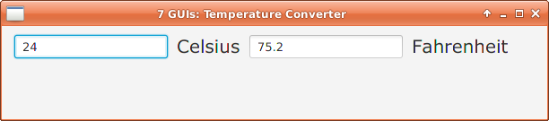

= GUI 2: Temperature Converter

https://github.com/eugenkiss/7guis/wiki#temperature-converter[Temperature Converter in original 7 GUIs]

== Usage

You can run the application either from the commandline or from the IDE.

=== Commandline

From the commandline in folder _combined_ invoke:

----
./gradlew run
----

=== IntelliJ IDEA

To run it from IntelliJ IDEA simply open _build.gradle_ in the folder _combined_ and then run _ApplicationInMemoryStarter_.

=== Other IDEs

With the proper gradle support/plugins it should also be possible to open the gradle files with Eclipse or Netbeans.
Alternatively you can convert the gradle files to maven pom files.

== How it is done

From an OpenDolphin point of view the interesting parts are the following:

In the start routine of the JavaFX Application *setupStage* is called which creates all the widgets for the GUI.
No widgets are not populated with meaningful data yet.

Then *initializePMs* is called which sends the *INIT* command to the server.
As in the _counter_ example *setupBinding* is called in it's _OnFinishedHandler_ without using the passed presentation models.

At the point in time it is clear that all the PMs exist on the serverside and on the clientside.
This means the widgets and the presentation modesls can be safely bound to each other.

In *setupBinding*

.setupBinding()
----
PresentationModel pm = clientDolphin.getAt(PM_APP);

JFXBinder.bind("text").of(celsiusTextField).to(ATT_CELSIUS).of(pm);
JFXBinder.bind(ATT_CELSIUS).of(pm).to("text").of(celsiusTextField);

JFXBinder.bind("text").of(fahrenheitTextField).to(ATT_FAHRENHEIT).of(pm);
JFXBinder.bind(ATT_FAHRENHEIT).of(pm).to("text").of(fahrenheitTextField);

celsiusTextField.focusedProperty().addListener((s,o,gained) -> {
  System.out.println("celsiusTextField.focusedProperty: gained: " + gained);
  if (gained) {
    pm.getAt(ATT_DIRECTION).setValue(VAL_DIRECTION_CELSIUS_TO_FAHRENHEIT);
  }
});

fahrenheitTextField.focusedProperty().addListener((s,o,gained) -> {
  System.out.println("fahrenheitTextField.focusedProperty: gained: " + gained);
  if (gained) {
    pm.getAt(ATT_DIRECTION).setValue(VAL_DIRECTION_FAHRENHEIT_TO_CELSIUS);
  }
});
----

As expected the textfields for _celsius_ and _fahrenheit_ are bound to the appropriate Attributes.
More insteresting is the Attribute *ATT_DIRECTION* which is an indicator for client and server in which
direction the conversion should go.
It is set appropriately when either the _celsius_ or the _fahrenheit_ textfield get the focus.
We will see later how the serverside makes use of it.

These are the important points about the clientside.
As you can see it is really not much code.
So let's have a look at the serverside.

On the serverside the INIT command creates a PM holding the attributes:

* ATT_CELSIUS
* ATT_FAHRENHEIT
* ATT_DIRECTION with a value initialized to VAL_DIRECTION_CELSIUS_TO_FAHRENHEIT

In addition PropertyChangelisteners are registered on ATT_CELSIUS and ATT_FAHRENHEIT.
Here is the one for ATT_CELSIUS:

----
pm.getAt(ATT_CELSIUS).addPropertyChangeListener("value", evt -> {
  if (VAL_DIRECTION_FAHRENHEIT_TO_CELSIUS.equals(pm.getAt(ATT_DIRECTION).getValue())) { // <1>
    return;
  }
  String newValue = (String) evt.getNewValue();
  Double c = null;
  try {
    c = Double.valueOf(newValue);
    Double f = TemperatureConverter.fahrenheitFromCelsius(c);
    String sf = String.valueOf(f);
    pm.getAt(ATT_FAHRENHEIT).setValue(sf); // <2>
  } catch (NumberFormatException e) {
    // invalid celsius string
  }
});
----

<1> If ATT_DIRECTION is not in the expected mode we do nothing. This mechanism prevents endless cyclic updates between the two filds due to rounding errors.
<2> After having applied the the temperature conversion ATT_FAHRENHEIT is updated accordingly.

The PropertyCChangeListener for ATT_FAHRENHEIT looks almost the same.

Note that all this is done on the serverside and the code only deals with the PMs on the serverside.
The code is completly independent from any GUI technology.
But since OpenDolphin shares the presentation model between the server and the client and we have bound the widgets to the PMs on the client the values changed
on the serverside automatically appear on the GUI.

== Conclusion

The keypoint in this example is:

* The presentation model is created on the serverside and in the same step dependent attributes are bound to each other.
For example the dependency of the celsius value on the fahrenheit value (and vice versa) is not implemented on the client side via widgets or PMs
but on the attributes on the serverside. This makes this presentation model reusable. An upcoming HTML GUI just needs to bind it's widgets to the PM
and is done.

In the next blog post we will look at the *Flight Booker*.

