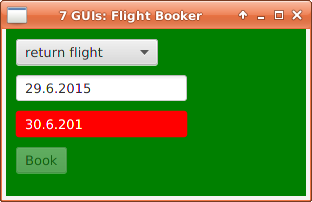

= GUI 3: Flight Booker

https://github.com/eugenkiss/7guis/wiki#flight-booker[Flight Booker in original 7 GUIs]

== Usage

You can run the application either from the commandline or from the IDE.

=== Commandline

From the commandline in folder _combined_ invoke:

----
./gradlew run
----

=== IntelliJ IDEA

To run it from IntelliJ IDEA simply open _build.gradle_ in the folder _combined_ and then run _ApplicationInMemoryStarter_.

=== Other IDEs

With the proper gradle support/plugins it should also be possible to open the gradle files with Eclipse or Netbeans.
Alternatively you can convert the gradle files to maven pom files.

== How it is done

Let's start again with _Application.java_.
In the previous example the initialization of the presentation models was done by calling the INIT command and then bind the widgets to them in the onFinishedHandler
which is called when the command completes.
In this example (in the bootstrap routine) it is done exactly the same using the CREATE_PMS command.
But in addition, when the binding is done the initialization of the data is also done from the serverside by calling the INIT_DATA command.

Why do we split the initialization process into a CREATE_PMS and an INIT_DATE phase?
Short answer: Because splitting the initilization procedure into two steps makes sure that data changes are properly applied at startup.

Long answer: Data changes happen either when the user changes data in a text widget for example.
This is the obvious way.
But they also happen during the initilization process and this is the problematic case:
when they happen before all bindings are completely set up it is likely that some data changes get lost.
In addition when reasoning about data changes you always have to think through two ways:
changes happening during the initialization process and changes after that during normal application usage.

When the initialization process is split we know for sure after the first phase (CREATE_PMS) that all PMs exist and PM to PM and PM to widget binding is setup completely.
This means in the second phase (INIT_DATA) we can perform data initialization on the server side and it will behave exactly the same as if the user was causing the data changes.
And this makes it much easier to think about the application's data change flow.

The OnFinishedHandler for CREATE_PMS is `MainViewInitializer.initializeBinding`.
Apart from using some helper classes for the widget binding it does not contain any new interesting things.
It simply contains the client side widget binding code.

The OnFinishedHandler for INIT_DATA is `MainViewInitializer.handleDataInitializedEvent`.
TODO: check why code needs to do anything where and why existing binding is not sufficient.

On the *serverside* the CREATE_PMS command creates the PM by calling _PMCreator.createPMs()_ and _PMBinder.initializePMBinding()_:

[source,java]
.PMCreator.createPMs()
----
public static void createPMs(ServerDolphin serverDolphin) {
  // Create PM:
  DTO dto = new DTO(
    new Slot(ATT_FLIGHT_TYPE, null),
    new Slot(ATT_START_DATE, null ),
    new Slot(ATT_START_DATE, null, null, VALID_TAG),
    new Slot(ATT_RETURN_DATE, null),
    new Slot(ATT_RETURN_DATE, null, null, VALID_TAG),
    new Slot(ATT_RETURN_DATE, null, null, Tag.ENABLED),
    new Slot(ATT_MESSAGE, null),
    new Slot(ATT_BOOK_COMMAND_ENABLED, null)
  );
  serverDolphin.presentationModel(PM_APP, null, dto);
}
----

One requirement is that TextFields need to indicate with a red background when their content is wrong.
To support this the attribute START_DATE carries the tag VALID_TAG.

Another requirement is that the textfield for the return date is only enabled when _return flight_ is selected from the dropdown widget.
Therefore the attribute RETURN_DATE carries the tag ENABLED.

[source,java]
.PMBinder.initializePMBinding()
----
public static void initializePMBinding(ServerDolphin serverDolphin, DomainLogic domainLogic) {

  ServerPresentationModel pm = serverDolphin.getAt(PM_APP);
  bindAttributeTo(pm.getAt(ATT_START_DATE), domainLogic::isDateStringValid, pm.getAt(ATT_START_DATE, VALID_TAG)); // <1>
  bindAttributeTo(pm.getAt(ATT_RETURN_DATE), domainLogic::isDateStringValid, pm.getAt(ATT_RETURN_DATE, VALID_TAG));

  // Handle change: flightType -> isReturnFlight:
  pm.getAt(ATT_FLIGHT_TYPE).addPropertyChangeListener(PROP_VALUE, evt -> { // <2>
    pm.getAt(ATT_RETURN_DATE, Tag.ENABLED).setValue(domainLogic.isReturnFlight(stringValue(pm.getAt(ATT_FLIGHT_TYPE))));
  });

  // Handle change: flightType | startDate | returnDate => BookCommandEnabled
  Arrays.asList(
    pm.getAt(ATT_FLIGHT_TYPE), pm.getAt(ATT_START_DATE), pm.getAt(ATT_RETURN_DATE)
  ).forEach(attr -> attr.addPropertyChangeListener(PROP_VALUE, evt -> evaluateBookCommandEnabled(pm, domainLogic)));
}
----

<1> Whenever START_DATE changes check if it is a valid date string and set the result on START_DATE/VALID_TAG. START_DATE/VALID_TAG
then can be used in the GUI binding code for the red background of the textfield.

<2> For attribute to attribute binding I usually use *PropertyChangeListener*s.
One could think of a DSL layer above them for easier usage but that does not exist yet.

Now let us look at the OnFinishedHandler for INIT_DATA:

[source,java]
.PMBinder.initializePMBinding
----
ClientPresentationModel pm = clientDolphin.getAt(PM_APP);
ComboBox<Pair<String, String>> cb = mainView.flightTypeComboBox;

cb.getItems().addAll(FXCollections.observableArrayList(pairlistFromString(SharedDolphinFunctions.stringValue(pm.getAt(ATT_FLIGHT_TYPES))))); // #<1>

ODComboBoxes.populateFromAttribute(cb, pm.getAt(ATT_FLIGHT_TYPE));

ODTextFields.populateFromAttribute(mainView.startDateTextField, pm.getAt(ATT_START_DATE)); // #<2>
ODTextFields.populateFromAttribute(mainView.returnDateTextField, pm.getAt(ATT_RETURN_DATE));

----

<1> Population of combobox by converting key-value pair string to List structure suitable for JavaFX
<2> Population of text field for START_DATE

You might wonder why the text field for START_DATE (and RETURN_DATA) is populated here on the clientside.
The reason is that a two-way binding for these widgets is not necessary and only at initialization time the data flows from attribute to widget. Afterwards the data always flows from widget to attribute.
That's also the reason why _MainViewInitializer.initializeBinding()_ is setting up a one-way binding from widget to attribute.
A two way binding would work as well and is easier to use.
On the other hand the data flow with the one-way binding by definiition goes in one direction only and therefore it is easier to reason about.

== Conclusion

The keypoint in this example is:

* Two-phase initialization: first create PMs and the bindings between them and second initialze the PMs with data on the serverside after the client finished the widget-PM binding.
* One-way bindings (START_DATE) and no-bindings (flighttypes combobox) are often sufficient.

Next we will look at the CRUD example but that is not done yet.

